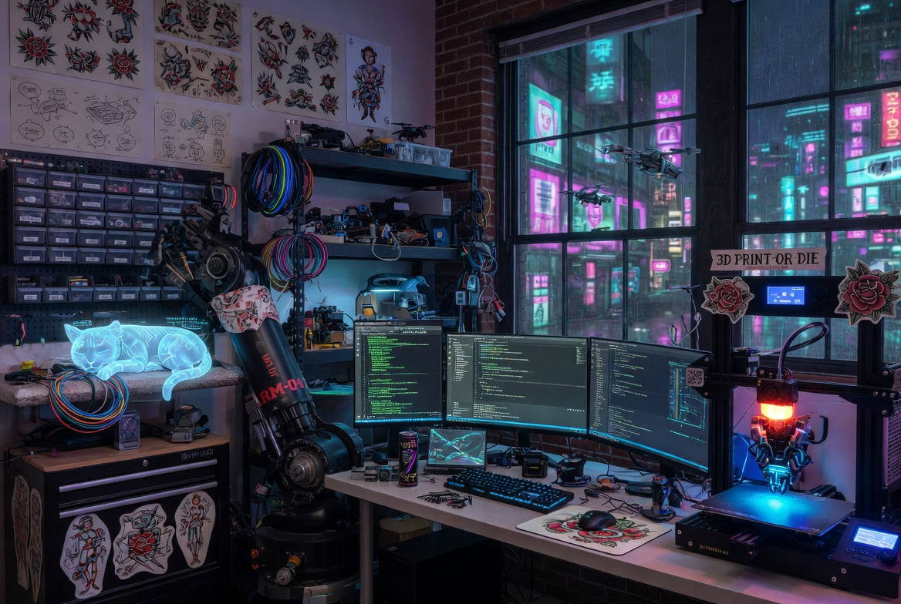

# orobot

CLI and agent toolkit for the [orobot.io](https://orobot.io) robotics platform. Control robots, manage programs, 3D print parts, and design robot assemblies — from the terminal or from an AI agent.

orobot.io lets you remotely control and program physical robots through a web browser. Raspberry Pi devices connect over WebSocket for real-time motor control, terminal access, and visual program editing from anywhere.

## Quick Start

```bash
npm install -g .
orobot login <email> <password>
orobot robots list --pretty
```

The session is saved locally to `.session` in the install directory. All commands output JSON. Add `--pretty` for human-readable formatting.

To point at a different API endpoint:

```bash
orobot --api http://localhost:8080 robots list
```

## CLI Commands

### Authentication

```
orobot login <email> <password>     Save session locally
orobot logout                       Clear session
orobot me                           Show current user
```

### Devices

Devices are physical Raspberry Pi boards running orobot firmware.

```
orobot devices list                 List your devices
orobot devices get <uuid>           Get device details
orobot devices create <name> <uuid> Create a device record
orobot devices register <uuid>      Register a device to your account
orobot devices code-register <code> Register by short code (from device screen)
```

### Robots

A robot is a named configuration that pairs a device with a program.

```
orobot robots list                  List your robots
orobot robots get <uuid>            Get robot details
orobot robots create <name> <programUuid>  Create a robot
```

### Programs

Programs define robot behavior — motor mappings, control scripts, and 3D assembly files.

```
orobot programs list                List your programs
orobot programs get <uuid>          Get program details (includes script, config, STLs)
orobot programs create <name>       Create an empty program
orobot programs search <query>      Search the program catalog
orobot programs publish <uuid>      Publish a program to the public catalog
orobot programs export <uuid>       Export program as a .zip archive
orobot programs import <zipfile>    Import program from a .zip archive
```

### Emulator

Test robot programs without physical hardware.

```
orobot emulator start <deviceUuid>  Start emulating a device
orobot emulator stop <deviceUuid>   Stop emulator
```

### Users and Comments

```
orobot users list                   List users
orobot users get <uuid>             Get user profile
orobot comments list <programUuid>  List comments on a program
orobot comments post <programUuid> <text>  Post a comment
```

### Files

```
orobot files upload <path> <programUuid>  Upload an STL, photo, or other file
orobot files download <url> <path>        Download a file to local disk
```

### 3D Printing

Print robot parts directly from orobot.io to a Moonraker-compatible 3D printer on your network. Supports Cura and ideaMaker slicers.

```
orobot print connect                Discover printers via mDNS and connect
orobot print setup                  Configure slicer paths
orobot print profiles               List available slicer profiles
orobot print program <programUuid>  Download STLs, slice, and send to printer
orobot print register               Register the orobot:// URI scheme (one-click print from browser)
```

The print workflow: `connect` finds your printer, `setup` configures your slicer, then `program <uuid>` downloads the STL files from orobot.io, slices them with your configured slicer and profile, and sends the G-code to your printer.

## Agent Toolkit

This repo also distributes skills and context for AI agents that interact with the orobot.io platform. See `Agent Markdown/AGENT.md` for the entry point.

### Using the CLI as an MCP Server

The CLI is the preferred way for agents to interact with orobot.io. Rather than making HTTP requests directly, agents should call `orobot` commands and parse the JSON output. This ensures consistent authentication, error handling, and rate limiting.

```bash
# Agent authenticates once
orobot login <email> <password>

# Then issues commands and parses JSON output
orobot programs list
orobot programs get <uuid>
orobot robots list
```

### Skills

Skills are structured guides in `Agent Markdown/skills/` that teach agents how to use specific parts of the platform:

| Skill | File | What it does |
|---|---|---|
| **Parts Builder (Playwright)** | `skills/parts-builder-playwright.md` | Step-by-step browser automation for building robot assemblies in the Parts Builder UI — placing parts, snapping sockets, saving |
| **Part Designer** | `skills/part-designer.md` | How to author JSCAD part definitions with typed sockets, motor constants, and mount surface templates |
| **Agent Design Robot** | `skills/agent-design-robot.md` | Full pipeline orchestrator: spec → JSCAD parts → browser assembly → program export |


## Project Structure

```
cli.js              CLI entry point (Commander.js)
client.js           HTTP client — authenticated requests to orobot.io API
session.js          Session persistence (~/.session file)
print-*.js          3D printing modules (discovery, slicing, G-code upload)
test/               Tests (node:test, 93 passing)
Agent Markdown/
  AGENT.md          Agent entry point — platform context and etiquette
  skills/           Structured agent skills for robot design and assembly
```

## Running Tests

```bash
npm test
```

Uses Node.js built-in test runner with experimental coverage.

## License

MIT — see [LICENSE](LICENSE).
